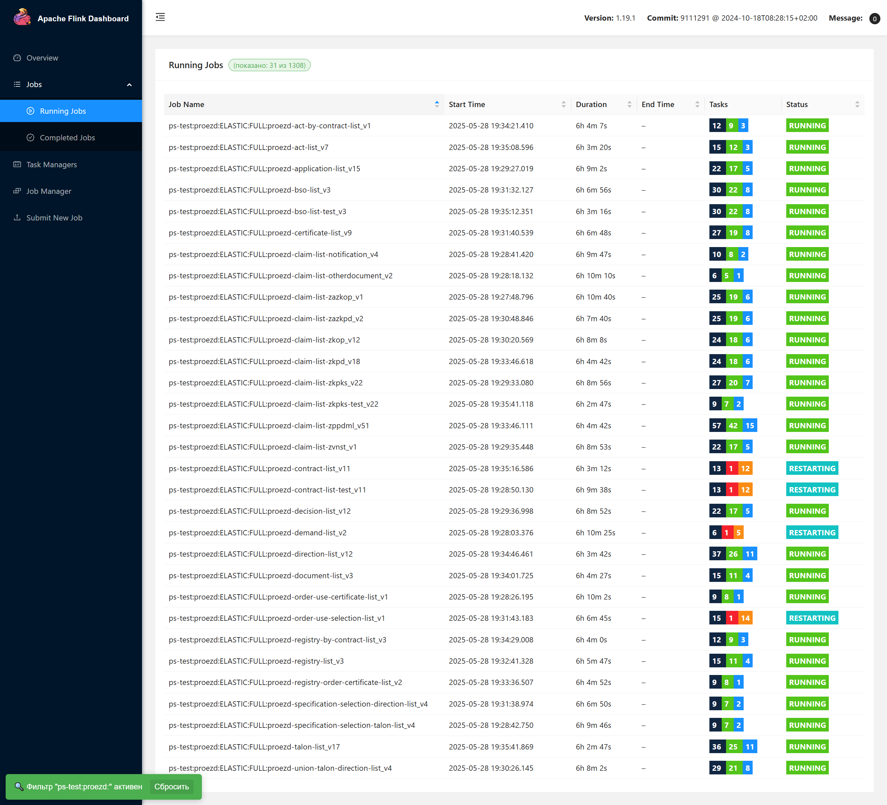

# Установка расширения в Chrome

## 1. Перейди в раздел расширений
   Открой свой браузер Chrome и введи в адресной строке: chrome://extensions/

## 2. Активируй режим разработчика
   В правом верхнем углу страницы ты увидишь переключатель "Режим разработчика". Включи его!

## 3. Загрузите распакованное расширение
   Нажми на кнопку **"Загрузить распакованное расширение"**.

## 4. Выберите папку с расширением
   Откроется диалоговое окно, выбери папку, содержащую код расширения.

## 5. Нажми "Выбрать"
   Chrome загрузит расширение из указанной папки, и оно станет доступным для использования!
